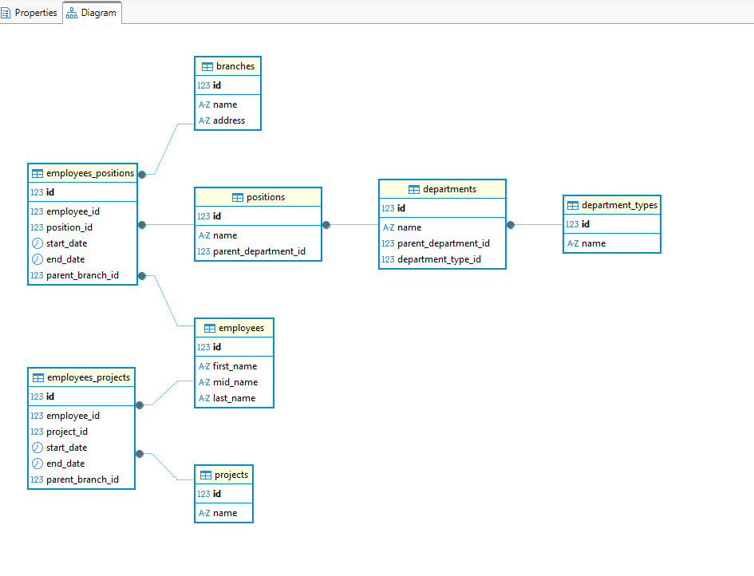
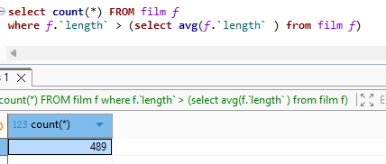
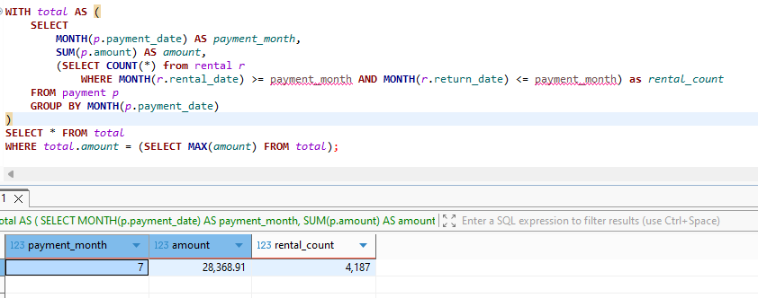
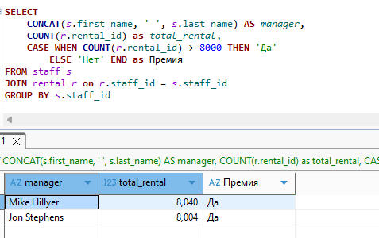
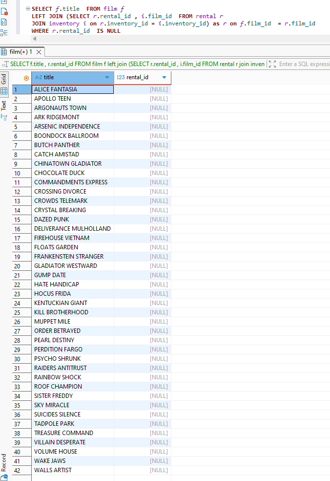

# Домашнее задание к занятию «SQL. Часть 2» - Шамаев Григорий

### Инструкция по выполнению домашнего задания

1. Сделайте fork [репозитория c шаблоном решения](https://github.com/netology-code/sys-pattern-homework) к себе в Github и переименуйте его по названию или номеру занятия, например, https://github.com/имя-вашего-репозитория/gitlab-hw или https://github.com/имя-вашего-репозитория/8-03-hw).
2. Выполните клонирование этого репозитория к себе на ПК с помощью команды `git clone`.
3. Выполните домашнее задание и заполните у себя локально этот файл README.md:
   - впишите вверху название занятия и ваши фамилию и имя;
   - в каждом задании добавьте решение в требуемом виде: текст/код/скриншоты/ссылка;
   - для корректного добавления скриншотов воспользуйтесь инструкцией [«Как вставить скриншот в шаблон с решением»](https://github.com/netology-code/sys-pattern-homework/blob/main/screen-instruction.md);
   - при оформлении используйте возможности языка разметки md. Коротко об этом можно посмотреть в [инструкции по MarkDown](https://github.com/netology-code/sys-pattern-homework/blob/main/md-instruction.md).
4. После завершения работы над домашним заданием сделайте коммит (`git commit -m "comment"`) и отправьте его на Github (`git push origin`).
5. Для проверки домашнего задания преподавателем в личном кабинете прикрепите и отправьте ссылку на решение в виде md-файла в вашем Github.
6. Любые вопросы задавайте в чате учебной группы и/или в разделе «Вопросы по заданию» в личном кабинете.

Желаем успехов в выполнении домашнего задания.

---

Задание можно выполнить как в любом IDE, так и в командной строке.

### Задание 1

Одним запросом получите информацию о магазине, в котором обслуживается более 300 покупателей, и выведите в результат следующую информацию: 
- фамилия и имя сотрудника из этого магазина;
- город нахождения магазина;
- количество пользователей, закреплённых в этом магазине.

``` SQL
SELECT 
ct.city as 'city',
Concat(sf.first_name, ' ', sf.last_name) as 'manager', 
count(c.customer_id ) as 'total_customers'
FROM store s 
	JOIN customer c on s.store_id  = c.store_id 
	LEFT JOIN address a on s.address_id =a.address_id
	LEFT JOIN staff sf on s.manager_staff_id =sf.staff_id 
	LEFT JOIN city ct on a.city_id = ct.city_id
GROUP by s.store_id 
HAVING  total_customers > 300;
```


### Задание 2

Получите количество фильмов, продолжительность которых больше средней продолжительности всех фильмов.
``` SQL 
SELECT count(*) FROM film f 
WHERE f.`length` > (SELECT avg(f.`length` ) FROM film f)
```
  
### Задание 3

Получите информацию, за какой месяц была получена наибольшая сумма платежей, и добавьте информацию по количеству аренд за этот месяц.
``` SQL
WITH total AS (
    SELECT 
        MONTH(p.payment_date) AS payment_month,
        SUM(p.amount) AS amount,
        (SELECT COUNT(*) from rental r
			WHERE MONTH(r.rental_date) >= payment_month AND MONTH(r.return_date) <= payment_month) as rental_count
    FROM payment p
    GROUP BY MONTH(p.payment_date)
)
SELECT * FROM total 
WHERE total.amount = (SELECT MAX(amount) FROM total);
```
  


## Дополнительные задания (со звёздочкой*)
Эти задания дополнительные, то есть не обязательные к выполнению, и никак не повлияют на получение вами зачёта по этому домашнему заданию. Вы можете их выполнить, если хотите глубже шире разобраться в материале.

### Задание 4*

Посчитайте количество продаж, выполненных каждым продавцом. Добавьте вычисляемую колонку «Премия». Если количество продаж превышает 8000, то значение в колонке будет «Да», иначе должно быть значение «Нет».

``` SQL
SELECT 
    CONCAT(s.first_name, ' ', s.last_name) AS manager,
    COUNT(r.rental_id) as total_rental,
    CASE WHEN COUNT(r.rental_id) > 8000 THEN 'Да'
        ELSE 'Нет' END as Премия
FROM staff s 
JOIN rental r on r.staff_id = s.staff_id 
GROUP BY s.staff_id
```



### Задание 5*

Найдите фильмы, которые ни разу не брали в аренду.

``` SQL
SELECT f.title  FROM film f 
LEFT JOIN (SELECT r.rental_id , i.film_id  FROM rental r 
JOIN inventory i on r.inventory_id = i.inventory_id) as r on f.film_id  = r.film_id
WHERE r.rental_id  IS NULL
```

