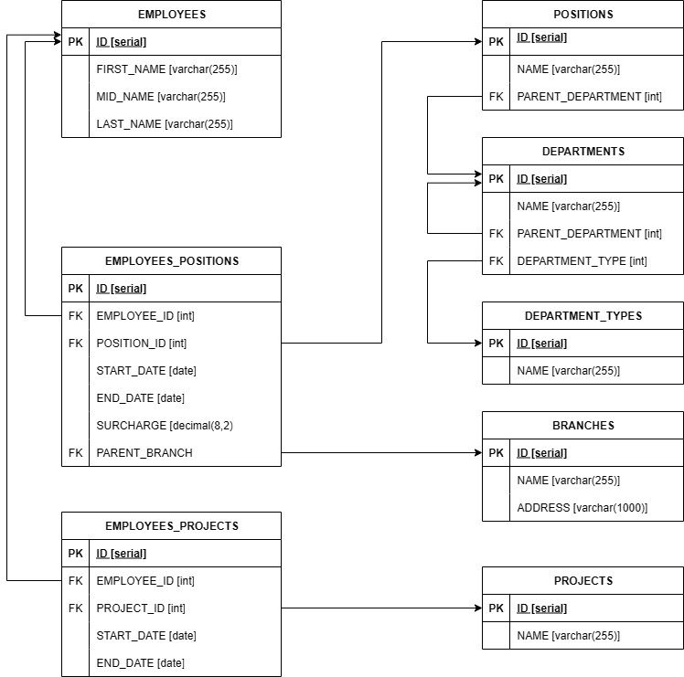

# Домашнее задание к занятию `"Практическое задание с самопроверкой «Базы данных»"` - `Шамаев Григорий`


### Инструкция по выполнению домашнего задания

   1. Сделайте `fork` данного репозитория к себе в Github и переименуйте его по названию или номеру занятия, например, https://github.com/имя-вашего-репозитория/git-hw или  https://github.com/имя-вашего-репозитория/7-1-ansible-hw).
   2. Выполните клонирование данного репозитория к себе на ПК с помощью команды `git clone`.
   3. Выполните домашнее задание и заполните у себя локально этот файл README.md:
      - впишите вверху название занятия и вашу фамилию и имя
      - в каждом задании добавьте решение в требуемом виде (текст/код/скриншоты/ссылка)
      - для корректного добавления скриншотов воспользуйтесь [инструкцией "Как вставить скриншот в шаблон с решением](https://github.com/netology-code/sys-pattern-homework/blob/main/screen-instruction.md)
      - при оформлении используйте возможности языка разметки md (коротко об этом можно посмотреть в [инструкции  по MarkDown](https://github.com/netology-code/sys-pattern-homework/blob/main/md-instruction.md))
   4. После завершения работы над домашним заданием сделайте коммит (`git commit -m "comment"`) и отправьте его на Github (`git push origin`);
   5. Для проверки домашнего задания преподавателем в личном кабинете прикрепите и отправьте ссылку на решение в виде md-файла в вашем Github.
   6. Любые вопросы по выполнению заданий спрашивайте в чате учебной группы и/или в разделе “Вопросы по заданию” в личном кабинете.
   
Желаем успехов в выполнении домашнего задания!
   
### Дополнительные материалы, которые могут быть полезны для выполнения задания

1. [Руководство по оформлению Markdown файлов](https://gist.github.com/Jekins/2bf2d0638163f1294637#Code)

---

### Задание 1

Опишите не менее семи таблиц, из которых состоит база данных. Определите:

- какие данные хранятся в этих таблицах,
- какой тип данных у столбцов в этих таблицах, если данные хранятся в PostgreSQL.

Начертите схему полученной модели данных. Можете использовать онлайн-редактор: https://app.diagrams.net/

Этапы реализации:
1.	Внимательно изучите предоставленный вам файл с данными и подумайте, как можно сгруппировать данные по смыслу.
2.	Разбейте исходный файл на несколько таблиц и определите список столбцов в каждой из них. 
3.	Для каждого столбца подберите подходящий тип данных из PostgreSQL. 
4.	Для каждой таблицы определите первичный ключ (PRIMARY KEY).
5.	Определите типы связей между таблицами. 
6.	Начертите схему модели данных.
На схеме должны быть чётко отображены:
   - все таблицы с их названиями,
   - все столбцы  с указанием типов данных,
   - первичные ключи (они должны быть явно выделены),
   - линии, показывающие связи между таблицами.

#### Результат задания 1



---

### Задание 2*

1. Разверните СУБД Postgres на своей хостовой машине, на виртуальной машине или в контейнере docker.
2. Опишите схему, полученную в предыдущем задании, с помощью скрипта SQL.
3. Создайте в вашей полученной СУБД новую базу данных и выполните полученный ранее скрипт для создания вашей модели данных.

В качестве решения приложите SQL скрипт и скриншот диаграммы.


### Результат задания 2
#### 1. Скрипт для создания таблицы

```
CREATE TABLE EMPLOYEES (
    ID SERIAL PRIMARY KEY,
    FIRST_NAME VARCHAR(255) NOT NULL,
    MID_NAME VARCHAR(255),
    LAST_NAME VARCHAR(255) NOT NULL
);

CREATE TABLE DEPARTMENT_TYPES (
    ID SERIAL PRIMARY KEY,
    NAME VARCHAR(255) NOT NULL UNIQUE
);

CREATE TABLE PROJECTS (  
    ID SERIAL PRIMARY KEY,
    NAME VARCHAR(255) NOT NULL UNIQUE
);

CREATE TABLE BRANCHES (
    ID SERIAL PRIMARY KEY,
    NAME VARCHAR(255) NOT NULL,
    ADDRESS VARCHAR(1000) NOT NULL 
);

CREATE TABLE DEPARTMENTS (
    ID SERIAL PRIMARY KEY,
    NAME VARCHAR(255) NOT NULL,
    PARENT_DEPARTMENT_ID INT,
    DEPARTMENT_TYPE_ID INT NOT NULL,
    FOREIGN KEY (DEPARTMENT_TYPE_ID) REFERENCES DEPARTMENT_TYPES(ID) 
);

CREATE TABLE POSITIONS (
    ID SERIAL PRIMARY KEY,
    NAME VARCHAR(255) NOT NULL,
    PARENT_DEPARTMENT_ID INT NOT NULL,
    FOREIGN KEY (PARENT_DEPARTMENT_ID) REFERENCES DEPARTMENTS(ID)  
);

CREATE TABLE EMPLOYEES_PROJECTS (
    ID SERIAL PRIMARY KEY,
    EMPLOYEE_ID INT NOT NULL,
    PROJECT_ID INT NOT NULL,
    START_DATE DATE NOT NULL,
    END_DATE DATE,
    PARENT_BRANCH_ID INT NOT NULL,  
    FOREIGN KEY (EMPLOYEE_ID) REFERENCES EMPLOYEES(ID),
    FOREIGN KEY (PROJECT_ID) REFERENCES PROJECTS(ID),
    UNIQUE (EMPLOYEE_ID, PROJECT_ID)
);

CREATE TABLE EMPLOYEES_POSITIONS (
    ID SERIAL PRIMARY KEY,
    EMPLOYEE_ID INT NOT NULL,
    POSITION_ID INT NOT NULL,
    START_DATE DATE NOT NULL,
    END_DATE DATE,
    PARENT_BRANCH_ID INT NOT NULL, 
    FOREIGN KEY (EMPLOYEE_ID) REFERENCES EMPLOYEES(ID),
    FOREIGN KEY (POSITION_ID) REFERENCES POSITIONS(ID),
    FOREIGN KEY (PARENT_BRANCH_ID) REFERENCES BRANCHES(ID),
    UNIQUE (EMPLOYEE_ID, POSITION_ID)
);
```
#### 2. Диаграмма созданной Базы Данных  

