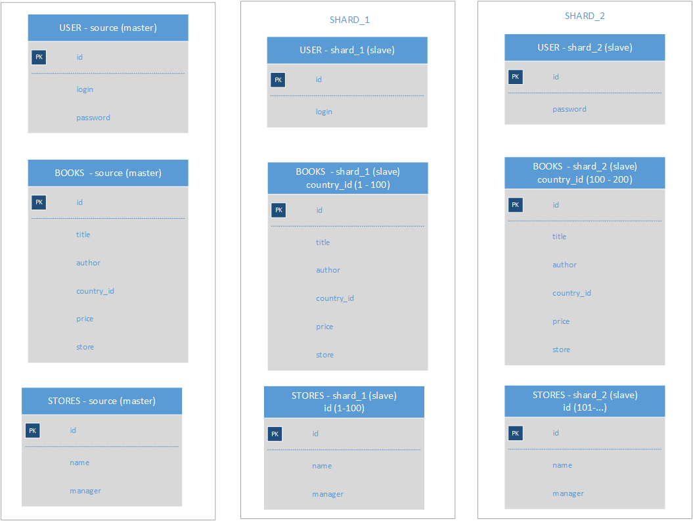

<<<<<<< HEAD
# Домашнее задание к занятию «Репликация и масштабирование. Часть 2» - Шамаев Григорий
=======
# Домашнее задание к занятию «Индексы» - Шамаев Григорий
>>>>>>> 8346280b95128b99691c23b1a78d19ef0fa42102

### Инструкция по выполнению домашнего задания

1. Сделайте fork [репозитория c шаблоном решения](https://github.com/netology-code/sys-pattern-homework) к себе в Github и переименуйте его по названию или номеру занятия, например, https://github.com/имя-вашего-репозитория/gitlab-hw или https://github.com/имя-вашего-репозитория/8-03-hw).
2. Выполните клонирование этого репозитория к себе на ПК с помощью команды `git clone`.
3. Выполните домашнее задание и заполните у себя локально этот файл README.md:
   - впишите вверху название занятия и ваши фамилию и имя;
   - в каждом задании добавьте решение в требуемом виде: текст/код/скриншоты/ссылка;
   - для корректного добавления скриншотов воспользуйтесь инструкцией [«Как вставить скриншот в шаблон с решением»](https://github.com/netology-code/sys-pattern-homework/blob/main/screen-instruction.md);
   - при оформлении используйте возможности языка разметки md. Коротко об этом можно посмотреть в [инструкции по MarkDown](https://github.com/netology-code/sys-pattern-homework/blob/main/md-instruction.md).
4. После завершения работы над домашним заданием сделайте коммит (`git commit -m "comment"`) и отправьте его на Github (`git push origin`).
5. После отправки ссылки на решение в виде md-файла в вашем Github в личном кабинете появится эталонный ответ.
6. Любые вопросы задавайте в чате учебной группы и/или в разделе «Вопросы по заданию» в личном кабинете.

Желаем успехов в выполнении домашнего задания.

### Задание 1

<<<<<<< HEAD
Опишите основные преимущества использования масштабирования методами:

- активный master-сервер и пассивный репликационный slave-сервер; 
Основные преимущества:
1. Высокая доступность и отказоустойчивость 
2. Резервное копирование без нагрузки на основную систему
3. Возможность проведения технических работ без простоя

- master-сервер и несколько slave-серверов;
1. Масштабирование операций чтения
2. Повышение общей производительности системы
3. Распределение нагрузки:
4. Повышенная отказоустойчивость для операций чтения


*Дайте ответ в свободной форме.*

---

### Задание 2


Разработайте план для выполнения горизонтального и вертикального шаринга базы данных. База данных состоит из трёх таблиц: 

- пользователи, 
- книги, 
- магазины (столбцы произвольно). 

Опишите принципы построения системы и их разграничение или разбивку между базами данных.

*Пришлите блоксхему, где и что будет располагаться. Опишите, в каких режимах будут работать сервера.* 

=======
Напишите запрос к учебной базе данных, который вернёт процентное отношение общего размера всех индексов к общему размеру всех таблиц.
``` sql
SELECT (sum(index_length) / sum(data_length)) *100
FROM INFORMATION_SCHEMA.TABLES  t
where t.TABLE_SCHEMA = 'sakila';
```
### Задание 2

Выполните explain analyze следующего запроса:
```sql
select distinct concat(c.last_name, ' ', c.first_name), sum(p.amount) over (partition by c.customer_id, f.title)
from payment p, rental r, customer c, inventory i, film f
where date(p.payment_date) = '2005-07-30' and p.payment_date = r.rental_date and r.customer_id = c.customer_id and i.inventory_id = r.inventory_id
```
- перечислите узкие места;
Ответ:
1. Неоптимальное использование JOIN 
2. over (partition by c.customer_id, f.title) - зачем здесь выводить фильм, если в итоговой таблице он не выводится
3. Из предыдущего - если заменить over на group by, то не нужен distinct, т.к. он тормозит выполнение запроса
4. Лишний join на film
5. date(p.payment_date) = '2005-07-30' - лишнее преобразование в дату. Лучше от него избавиться и использовать индекс

- оптимизируйте запрос: внесите корректировки по использованию операторов, при необходимости добавьте индексы.

Можно привести запрос к виду
```sql
select  
concat(c.last_name, ' ', c.first_name),
sum(p.amount) 
from 
payment p
INNER JOIN rental r ON p.payment_date = r.rental_date
INNER JOIN customer c ON r.customer_id = c.customer_id
INNER JOIN inventory i ON r.inventory_id = i.inventory_id
WHERE p.payment_date >= '2005-07-30' 
  AND p.payment_date < '2005-07-31'
group by c.last_name, ' ', c.first_name;
```
И добавить индекс
```sql
CREATE INDEX idx_payment_date ON payment(payment_date);
```
>>>>>>> 8346280b95128b99691c23b1a78d19ef0fa42102

## Дополнительные задания (со звёздочкой*)
Эти задания дополнительные, то есть не обязательные к выполнению, и никак не повлияют на получение вами зачёта по этому домашнему заданию. Вы можете их выполнить, если хотите глубже шире разобраться в материале.

<<<<<<< HEAD
---
### Задание 3*

Выполните настройку выбранных методов шардинга из задания 2.

*Пришлите конфиг Docker и SQL скрипт с командами для базы данных*.
=======
### Задание 3*

Самостоятельно изучите, какие типы индексов используются в PostgreSQL. Перечислите те индексы, которые используются в PostgreSQL, а в MySQL — нет.

*Приведите ответ в свободной форме.*
>>>>>>> 8346280b95128b99691c23b1a78d19ef0fa42102
